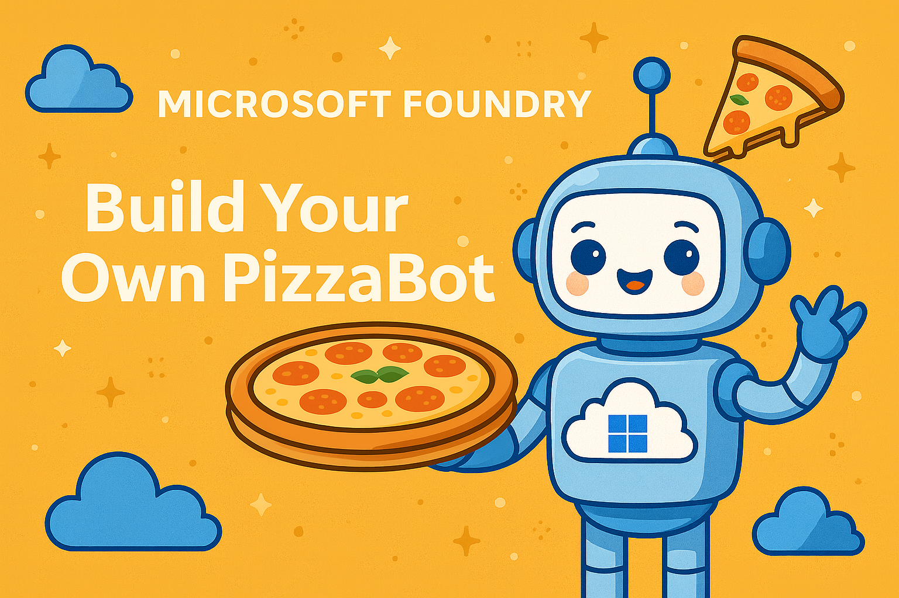

# Microsoft Foundry Agent Workshop 🚀  

**English** | **[Español](readme.es.md)** | **[Português](readme.pt.md)**

## Aperçu de l'atelier

Dans cet atelier pratique, vous apprendrez à créer des agents d'IA intelligents et adaptés à un domaine spécifique grâce à **Foundry Agent Service**.
Nous procéderons étape par étape, de la création d'un agent de base à son extension avec des outils personnalisés, des données externes et des intégrations en direct.

À la fin de cet atelier, vous aurez construit votre propre **PizzaBot Contoso**, un assistant IA capable de :
- Suivre les **instructions personnalisées du système**.
- Utilisation de la **génération augmentée par la recherche (RAG)** pour répondre aux questions issues de documents personnalisés
- Utiliser des outils personnalisés, comme un calculateur de pizza, pour faire appel à des **outils personnalisés**.
- Intégration avec un **serveur MCP** pour la gestion des menus et des commandes en temps réel  

## Agenda

- **Démarrage & Configuration**  
  Introduction, objectifs de l'atelier et configuration de l'abonnement Azure
  
- **Chapitre 1 : Créer votre premier agent**  
  Connectez-vous à Azure, installez les packages et créez un agent GPT-4o simple.
  
- **Chapitre 2 : Invites et instructions système**  
   Découvrez comment les invites influencent le comportement de l’agent et ajoutez des instructions personnalisées à partir du fichier `instructions.txt`.
  
 - **Chapitre 3 : Ajout de connaissances (RAG)**  
  Ancrez votre agent dans les données de votre pizzeria à l’aide de la recherche de fichiers et d’un magasin vectoriel.

- **Chapitre 4 : Appel d’outils**  
  Étendez les fonctionnalités de votre agent avec une fonction de calcul de pizza personnalisée et l’intégration d’un ensemble d’outils. 

- **Chapitre 5 : Intégration MCP**  
  Connectez-vous à un serveur MCP pour accéder aux menus de pizzas en temps réel, aux garnitures et à la gestion des commandes.

- **Tests et conclusion**  
 Testez PizzaBot de bout en bout, répondez aux questions et découvrez les prochaines étapes. 

## Ce dont vous aurez besoin
- Un navigateur et un accès au [portail Azure](https://portal.azure.com)
- Un [Azure subscription](docs/get-azure) fourni ou utilisez le vôtre
- Un environnement de développement ([developement environment](docs/dev-environment) ) avec Python 3.13 ou une version ultérieure installé
- Connaissances de base en Python (aucune connaissance approfondie en IA requise !)

## Objectif de l'atelier
À la fin de cette session de 2 heures, vous saurez :
1. Créer et configurer un agent dans Microsoft Foundry
2. Guider son comportement à l'aide d'**invites système**
3. L'ancrer dans des données réelles grâce à **RAG**
4. Étendre ses fonctionnalités avec des **outils personnalisés**
5. Le connecter à des services externes avec **MCP**

Vous repartirez avec des connaissances pratiques et un agent **PizzaBot** fonctionnel que vous pourrez adapter à des cas d'utilisation concrets.
