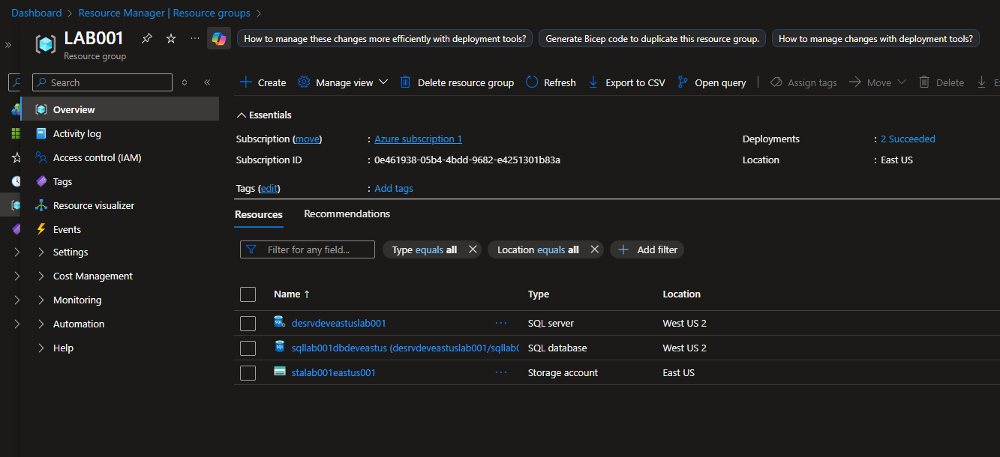

# Desafio 01 – Armazenando dados de um e-Commerce na Cloud

## 📌 Status
✅ Concluído

## 🎯 Descrição do desafio
Desenvolver uma solução para armazenar e gerenciar dados de um e-Commerce
na nuvem, com foco em escalabilidade, segurança e eficiência, utilizando
serviços do Microsoft Azure.

## 🧩 Cenário proposto
O cenário simula uma aplicação de e-Commerce que precisa armazenar
informações como dados de produtos, imagens, valores e nomes, garantindo
a persistência e organização desses dados em ambiente de nuvem.

## 🏗️ Solução adotada
A solução adotada foi utilizar os serviços de armazenamento do Azure como
back-end da aplicação, garantindo a permanência dos dados e a separação
entre informações estruturadas e não estruturadas.

## 🛠️ Serviços Azure Utilizados
- Azure Storage Account  
- Azure SQL Database  

## 📷 Evidências

## 🧠 Principais aprendizados
- Compreensão do funcionamento do Azure Storage Account  
- Configuração de banco de dados e criação de tabelas no Azure SQL Database  
- Implementação e salvamento de imagens utilizando Azure Blob Storage  

## 📝 Observações
Este desafio foi importante para aplicar, na prática, os conceitos de
armazenamento em nuvem, conectando o conteúdo teórico com um cenário
real de aplicação em Cloud Computing.
