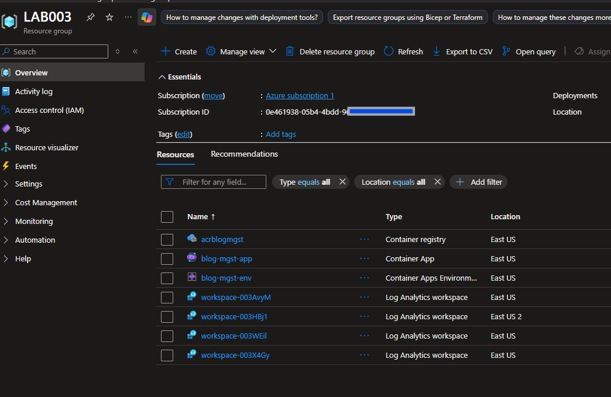
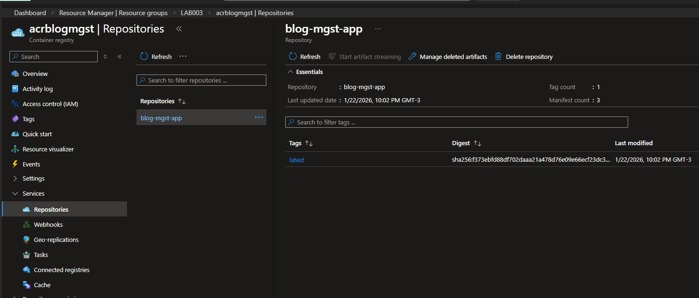
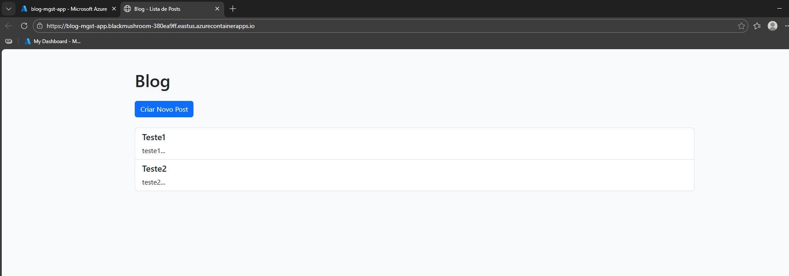

# Criar um Blog com Container Apps

## 📌 Status
✅ Concluído

## 🎯 Descrição do desafio

Demonstrar como publicar uma aplicação web simples utilizando Azure Container Apps, focando no processo de conteinerização, publicação da imagem e execução do serviço em ambiente gerenciado (serverless para contêineres).

## 🧩 Cenário proposto

O cenário simula a criação e publicação de um blog, empacotado em um contêiner Docker e executado no Azure Container Apps.

## 🏗️ Solução adotada

A solução foi estruturada da seguinte forma:

- Criação de uma aplicação web simples (HTML + CSS)
- Build da imagem Docker no Nginx
- Publicação da imagem no **Azure Container Registry (ACR)**
- Criação de um ambiente de **Azure Container Apps**
- Deploy do contêiner utilizando a imagem armazenada no ACR

## 🛠️ Serviços Azure Utilizados

- Azure Container Apps
- Azure Container Registry (ACR)
- Azure Resource Group
- Docker
- Nginx

## 📷 Evidências

      
    
    

## 🧠 Principais aprendizados

 Conceito e funcionamento do Azure Container Apps
- Diferença entre Container Apps e AKS
- Uso do ACR como repositório de imagens
- Deploy de aplicações conteinerizadas sem necessidade de orquestração complexa
- Modelo serverless aplicado a contêineres

## 📝 Observações

Este desafio reforça o uso do **Azure Container Apps** como uma
alternativa mais simples ao AKS para aplicações web e APIs
conteinerizadas, especialmente em cenários sem necessidade de
controle avançado de cluster.

## 🔗 Recursos Complementares

- Pasta do Laboratório: [Laboratório](/microsoft-azure-cloud-native-2026/04-laboratorios/lab03-1-criando-um-blog-com-container-app/)
- Códigos utilizados: [Códigos](/microsoft-azure-cloud-native-2026/04-laboratorios/lab03-1-criando-um-blog-com-container-app/codigos/)
- Imagens do ambiente: [Imagens](/microsoft-azure-cloud-native-2026/04-laboratorios/lab03-1-criando-um-blog-com-container-app/imagens/)
