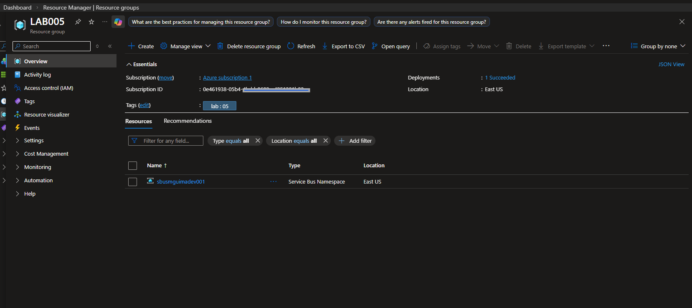
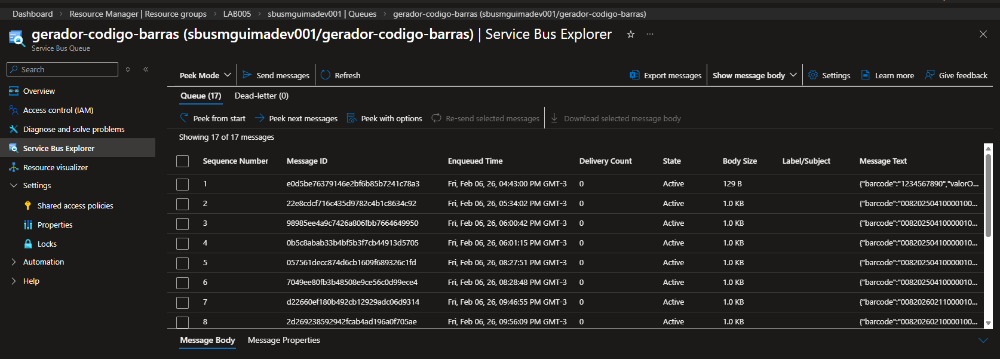
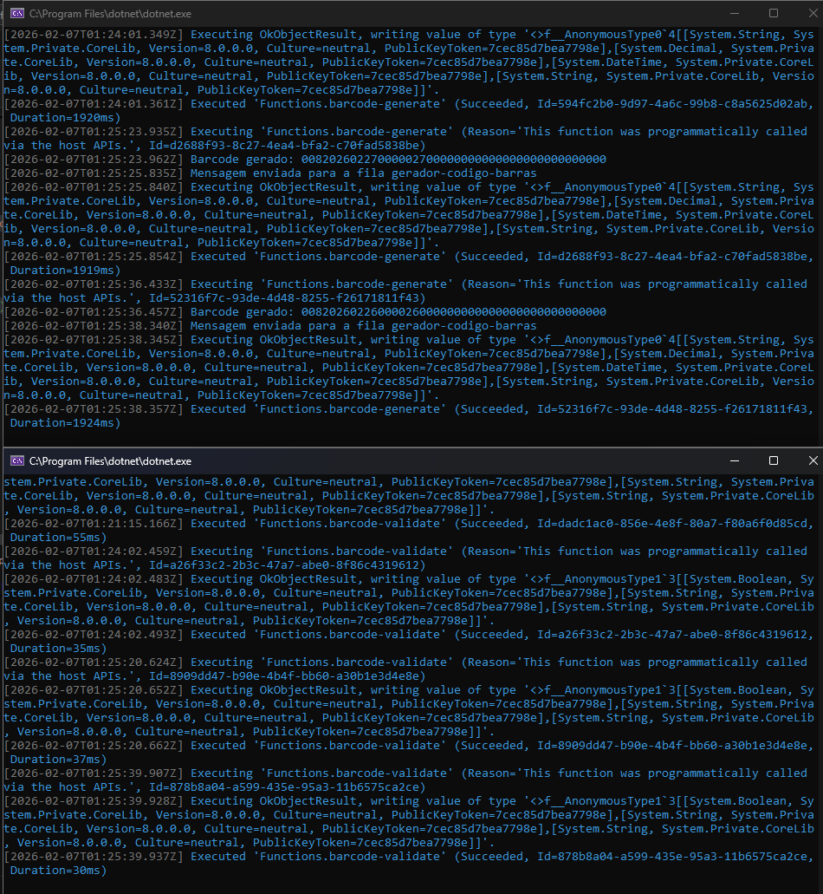
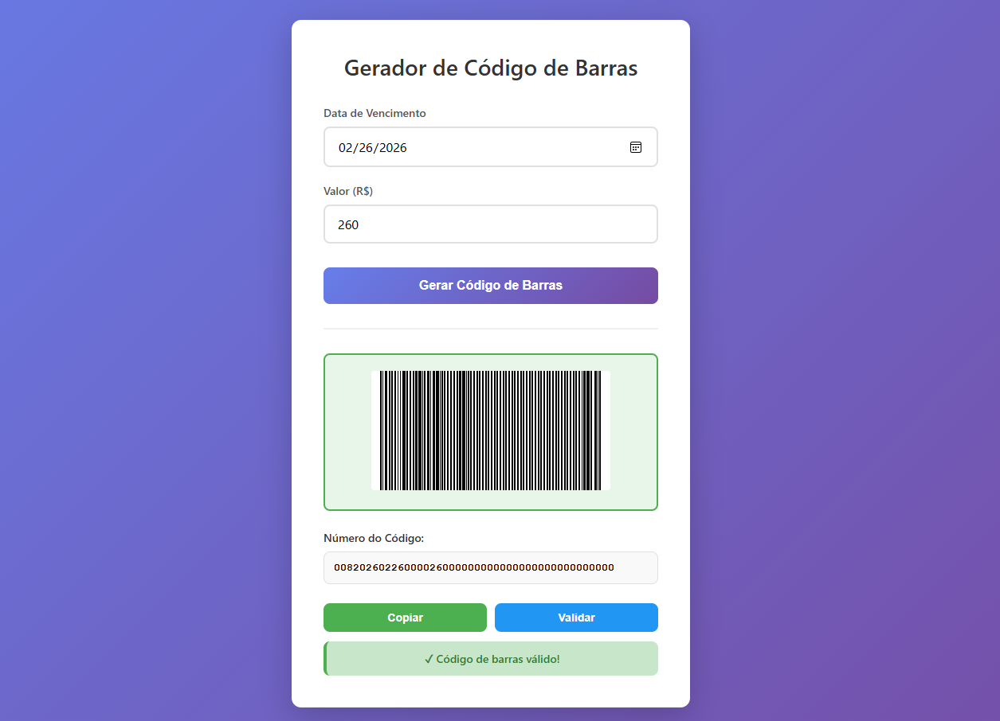

# Desafio de Projeto — API Serverless para Geração e Validação de Boletos

## 📌 Status
✅ Concluído

## 🎯 Objetivo do Projeto
O objetivo deste projeto é criar duas **APIs serverless** para simular um fluxo básico de **geração e validação de boletos**, utilizando **Azure Functions** e aplicando conceitos de computação serverless.

O foco principal está na **estrutura da solução**, separação de responsabilidades e uso de funções fortemente tipadas para garantir maior controle e confiabilidade.

## 🧠 Visão Geral da Solução
A solução foi desenhada de forma simples e incremental, mantendo o contexto para evoluções futuras.

O fluxo funciona da seguinte forma:

1. Um cliente acessa uma página HTML simples
2. A página consome uma API responsável por **gerar um boleto**
3. A API retorna:
   - Código de barras
   - Valor associado ao boleto
4. Uma segunda API recebe esses dados e **valida o boleto gerado**
5. O resultado da validação é retornado ao cliente

## 🏗️ Arquitetura Atual

Nesta etapa do projeto, a arquitetura contempla:

- Interface simples em HTML para simulação do consumo da API
- Duas Azure Functions independentes:
  - **Geração de boleto**
  - **Validação de boleto**
- Comunicação direta via HTTP

Arquiteturas mais robustas, com troca de mensagens, eventos e múltiplos ciclos de processamento, foram discutidas conceitualmente e ficam planejadas para exercícios futuros.

## 🛠️ Tecnologias Utilizadas
- Azure Functions
- .NET (C#)
- Visual Studio
- HTTP Triggers
- Computação Serverless

## 📷 Evidências

      
    
    
    

## 🧠 Principais aprendizados
- Entendimento prático do modelo **serverless** e seus benefícios em custos e escalabilidade.
- Criação de **múltiplas APIs independentes** utilizando Azure Functions.
- Aplicação do princípio de **separação de responsabilidades** entre geração e validação de boletos.
- Uso de **HTTP Triggers** para expor funções como APIs REST.
- Importância de planejar a **evolução arquitetural**, mesmo em soluções iniciais simples.
- Experiência com desenvolvimento em **.NET (C#)** para funções de negócio críticas.
- Compreensão de como soluções serverless podem servir como base para arquiteturas orientadas a eventos.

## 🔗 Recursos Complementares
- Pasta do Laboratório: [Laboratório](/microsoft-azure-cloud-native-2026/04-laboratorios/lab05-criando-servico-autenticador-boletos/)
- Códigos utilizados: [Códigos](/microsoft-azure-cloud-native-2026/04-laboratorios/lab05-criando-servico-autenticador-boletos/codigos/)
- Imagens do ambiente: [Imagens](../../04-laboratorios/lab05-criando-servico-autenticador-boletos/imagens/)

