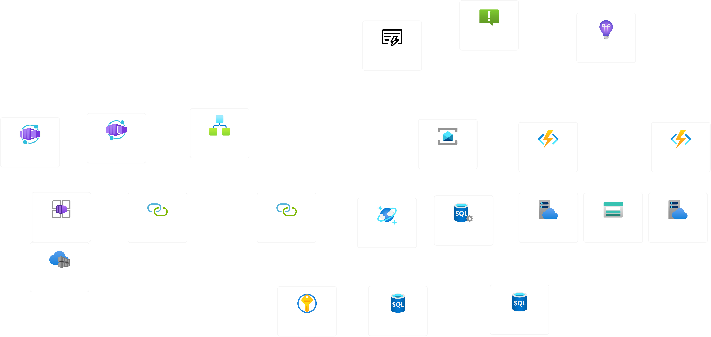
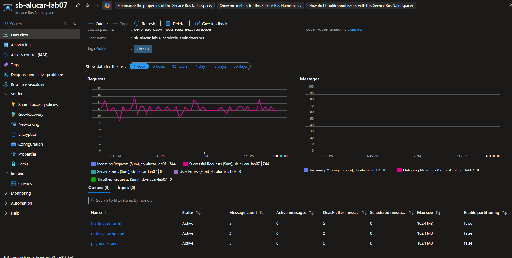
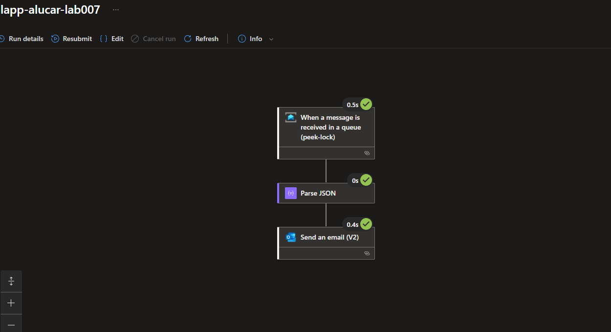
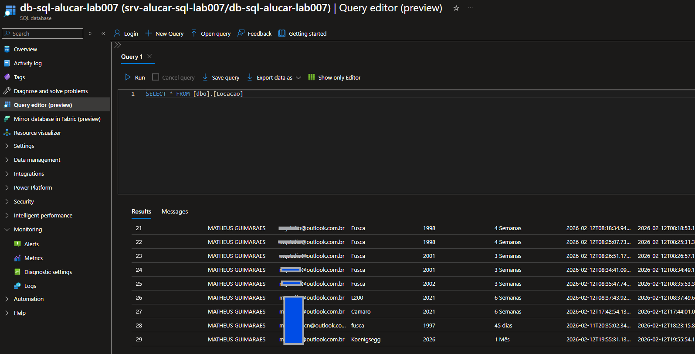

# Desafio de Projeto: Construção de uma Aplicação de Aluguel de Carros totalmente Cloud-Native

## 📌 Status
✅ Concluído

## 🎯 Objetivo do Projeto
Construir uma aplicação de **aluguel de carros** totalmente **cloud-native**, aplicando conceitos aprendidos no bootcamp Microsoft Azure Cloud Native 2026.  
O projeto integra **serverless, contêineres, armazenamento em nuvem e APIs seguras**.

## 🧠 Visão Geral da Solução
A arquitetura consiste em um sistema **Cloud Native** totalmente desacoplado onde frontend, backend e serviços de integração funcionam de forma escalável e resiliente.

## 🏗️ Arquitetura Atual
- Frontend é hospedado no **Azure Container Apps**.  
- Backend utiliza **Azure Functions**, **Service Bus Namespace** e **Logic Apps**.
- Os dados são armazenados no **Azure SQL Database** e **Azure Cosmos DB**.

## 🛠️ Tecnologias Utilizadas

- **Azure Container Apps** – APIs GET containerizada.
- **Service Bus Namespace** – Mensageria baseada em filas.
- **Azure Functions** – Processamento serverless das mensagens e execução das regras de negócio.
- **Azure SQL / Cosmos DB** – Persistência dos dados da aplicação.  
- **Azure Storage / Blob** – Armazenamento complementar de dados.
- **Azure Logic Apps** – Orquestração de fluxos e integração entre serviços.

## 📷 Evidências

      
    
    
    

## 🧠 Principais aprendizados
- Integração de múltiplos serviços Azure em uma aplicação real  
- Práticas de arquitetura cloud-native: modularidade, resiliência e escalabilidade  
- Deploy de frontend em Azure Container Apps  
- Configuração de variáveis de ambiente e segurança em Azure Functions  
- Monitoramento, logging e troubleshooting em ambientes distribuídos  

## 🔗 Recursos Complementares
- Pasta do Laboratório: [Laboratório](/microsoft-azure-cloud-native-2026/04-laboratorios/lab07-construcao-aplicacao-aluguel-carros-totalmente-cloud-native/)
- Códigos utilizados: [Códigos](/microsoft-azure-cloud-native-2026/04-laboratorios/lab07-construcao-aplicacao-aluguel-carros-totalmente-cloud-native/codigos/)
- Imagens do ambiente: [Imagens](../../04-laboratorios/lab07-construcao-aplicacao-aluguel-carros-totalmente-cloud-native/imagens/)