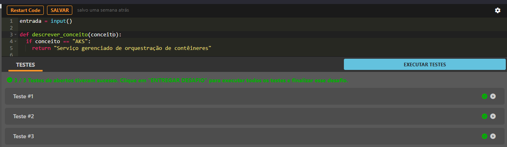
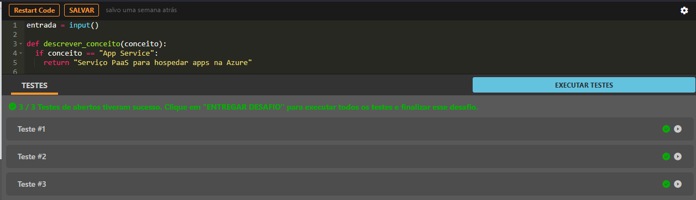

# Desbravando Contêineres com AKS e App Service

## 📌 Status

✅ Concluído

## 🔹 Parte 1 — Conceitos Fundamentais do AKS

## 🎯 Descrição do desafio

O Azure Kubernetes Service (AKS) é um serviço que permite orquestrar contêineres com facilidade, automatizando tarefas complexas como provisionamento, atualização e escalonamento. Neste desafio, você aprenderá os principais conceitos por trás do Kubernetes no contexto da Azure: o que são Pods, Nodes, Clusters e como esses elementos trabalham juntos para executar e escalar aplicações de forma eficiente.

## 🧩 Entrada

Uma string contendo um dos conceitos abaixo:

- AKS
- Pod
- Node
- Cluster

## 🏗️ Saída

A entrada consistirá no conceito do Azure Kubernetes Service (AKS) para o qual você deve retornar a descrição. Nesse contexto, os seguintes conceitos são considerados válidos para este desafio de código:

Serviço gerenciado de orquestração de contêineres
Unidade mínima de execução em um cluster Kubernetes
Máquina (VM) onde os Pods são executados
Conjunto de nós que executam aplicações containerizadas

## 📷 Evidências

      

## 🔹 Parte 2 — Conceitos Fundamentais do AKS

## 🎯 Descrição do desafio

Azure App Service é uma plataforma de hospedagem para aplicações web, APIs REST e backends móveis. Ele permite que desenvolvedores foquem em código, enquanto a Azure gerencia a infraestrutura. Neste desafio, você irá entender conceitos como escalabilidade automática, variáveis de ambiente (App Settings), slots de deployment para CI/CD e como tudo isso contribui para a entrega contínua de aplicações.

## 🧩 Entrada

Uma string contendo um dos conceitos abaixo:

- App Service
- Escalabilidade
- Slot de Deployment
- CI/CD

## 🏗️ Saída

A entrada consistirá no conceito do Azure App Service para o qual você deve retornar a descrição. Nesse contexto, os seguintes conceitos são considerados válidos para este desafio de código:

- Serviço PaaS para hospedar apps na Azure
- Ajusta recursos automaticamente conforme uso
- Ambiente isolado para testes de novas versões
- Automatiza build e deploy de aplicações

## 📷 Evidências

      

