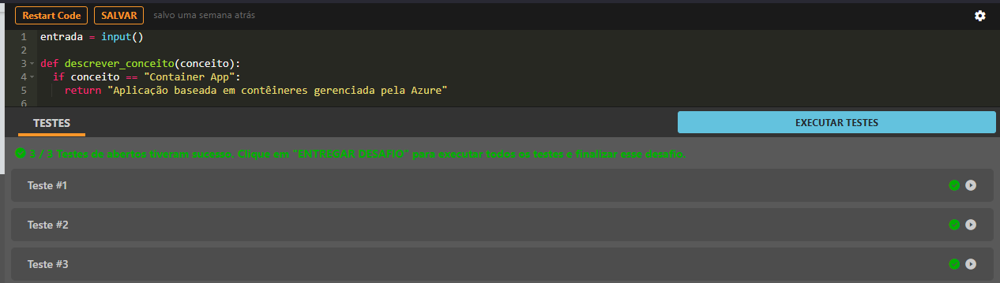
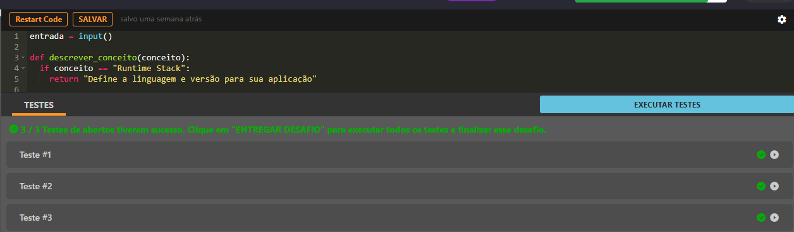

# Publicando e Escalando Apps com Estilo

## 📌 Status

✅ Concluído

## 🔹 Parte 1 — Componentes do Azure Container Apps

## 🎯 Descrição do desafio

O Azure Container Apps permite executar aplicações em contêineres com uma abordagem serverless, ou seja, sem precisar gerenciar servidores. Neste desafio, você será apresentado aos principais componentes dessa plataforma: Container App, Revisions, regras de escalonamento (scale rules) e Ingress, que habilita o acesso externo às aplicações.

## 🧩 Entrada

Uma string contendo um dos componentes abaixo:

- Container App
- Revision
- Scale rule
- Ingress

## 🏗️ Saída

A tabela abaixo apresenta exemplos com alguns dados de entrada e suas respectivas saídas esperadas. Certifique-se de testar seu programa com esses exemplos e com outros casos possíveis.

## 📷 Evidências

      

## 🔹 Parte 2 - Hospedagem com Azure App Service

## 🎯 Descrição do desafio

Neste desafio, aprofundamos em recursos práticos do Azure App Service voltados à configuração e à operação de aplicações. Você entenderá como funciona o Runtime Stack (ambiente de execução da linguagem), o uso de App Settings (variáveis de ambiente), como vincular domínios personalizados e como monitorar a aplicação em tempo real usando Log Stream.

## 🧩 Entrada

Uma string contendo um dos recursos abaixo:

- Runtime Stack
- App Settings
- Custom Domain
- Log Stream

## 🏗️ Saída

Descrição curta da funcionalidade.

## 📷 Evidências

      

