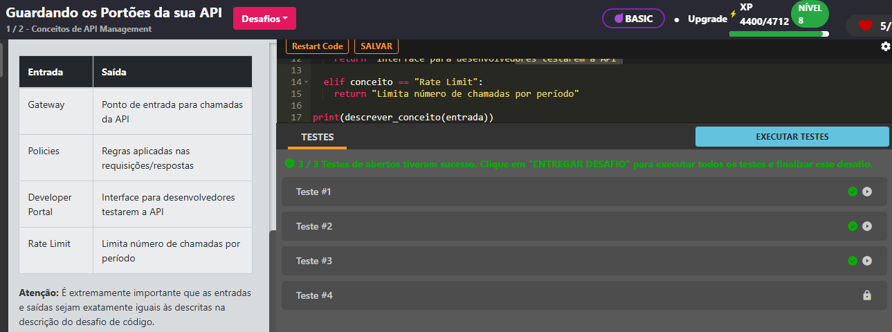
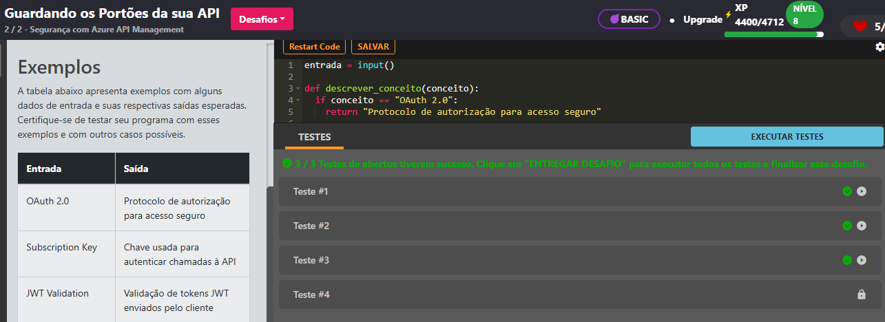

# Publicando e Escalando Apps com Estilo

## 📌 Status

✅ Concluído

## 🔹 Parte 1 — Conceitos de API Management

## 🎯 Descrição do desafio

O Azure API Management é uma solução para criar portas de entrada unificadas e seguras para suas APIs. Neste desafio, você aprenderá os principais componentes da plataforma: o gateway de entrada de requisições, as policies que controlam comportamento de chamadas, o portal do desenvolvedor para testes e documentação, e o controle de chamadas com Rate Limits.

## 🧩 Entrada

Uma string contendo um dos componentes abaixo:

- Gateway
- Policies
- Developer Portal
- Rate Limit

## 🏗️ Saída

A tabela abaixo apresenta exemplos com alguns dados de entrada e suas respectivas saídas esperadas. Certifique-se de testar seu programa com esses exemplos e com outros casos possíveis.

| Entrada          | Saída                                            |
| ---------------- | ------------------------------------------------ |
| Gateway          | 	Ponto de entrada para chamadas da API         |
| Policies         | 	Regras aplicadas nas requisições/respostas    |
| Developer Portal | 	Interface para desenvolvedores testarem a API |
| Rate Limit       | 	Limita número de chamadas por período         |

## 📷 Evidências

      

## 🔹 Parte 2 - Segurança com Azure API Management

## 🎯 Descrição do desafio

Garantir a segurança de APIs é fundamental para qualquer solução em nuvem. Neste desafio, você irá relacionar práticas e mecanismos comuns no Azure API Management, como o uso de OAuth 2.0 para autorização, Subscription Keys para controle de acesso, validação de tokens JWT e autenticação entre gateway e serviços de backend.

## 🧩 Entrada

Uma string contendo um dos recursos abaixo:

- OAuth 2.0
- Subscription Key
- JWT Validation
- Backend Authentication

## 🏗️ Saída

A tabela abaixo apresenta exemplos com alguns dados de entrada e suas respectivas saídas esperadas. Certifique-se de testar seu programa com esses exemplos e com outros casos possíveis.

| Entrada                | Saída                                         |
| ---------------------- | --------------------------------------------- |
| OAuth 2.0	             | Protocolo de autorização para acesso seguro   |
| Subscription Key       | Chave usada para autenticar chamadas à API    |
| JWT Validation         | Validação de tokens JWT enviados pelo cliente |
| Backend Authentication | Autentica chamadas entre gateway e backend    |

## 📷 Evidências

      

