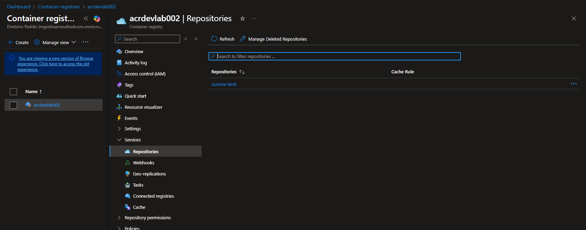

# Laboratório 02 — Deploy e Escalabilidade de Aplicação com AKS e ACR

Este laboratório foi desenvolvido em duas etapas, acompanhando a evolução do conteúdo ao longo das aulas.

## 📌 Status

✅ Concluído

## 🔹 Parte 1 — Fundamentos e Criação do Ambiente ([Aula 03](/microsoft-azure-cloud-native-2026/01-cursos/03-orquestracao-de-conteineres-com-azure-kubernetes-service-AKS/))

## 🎯 Objetivo

- Criar uma aplicação simples conteinerizada
- Publicar a imagem no Azure Container Registry
- Criar e configurar um cluster Kubernetes no Azure

## 🛠️ Serviços Azure Utilizados

- **Azure Container Registry (ACR)** - Armazenamento e gerenciamento das imagens de contêiner
- **Azure Kubernetes Service (AKS)** - Orquestração, deploy e escalabilidade da aplicação

## 🏗️ Configuração do Ambiente

- Criação de Resource Group dedicado ao projeto
- Provisionamento do AKS
- Criação do ACR  

## 📷 Evidências

    
    

## 🔹 Parte 2 — Criando app no AKS ([Aula 04](/microsoft-azure-cloud-native-2026/01-cursos/04-trabalhando-com-azure-kubernetes-services-aks-e-k8s/))

## 🎯 Objetivo

- Criar os .YAML para configuração do pod
- executar a aplicação no AKS utilizando a imagem gerada na parte 1 do lab

## 🛠️ Serviços Azure Utilizados

- **Azure Container Registry (ACR)** - Armazenamento e gerenciamento das imagens de contêiner
- **Azure Kubernetes Service (AKS)** - Orquestração, deploy e escalabilidade da aplicação

## 🏗️ Configuração do Ambiente

- Criação dos .yaml
- configuração do deployment
- comunicação entre AKS e ACR

## 📷 Evidências

    
    
    
