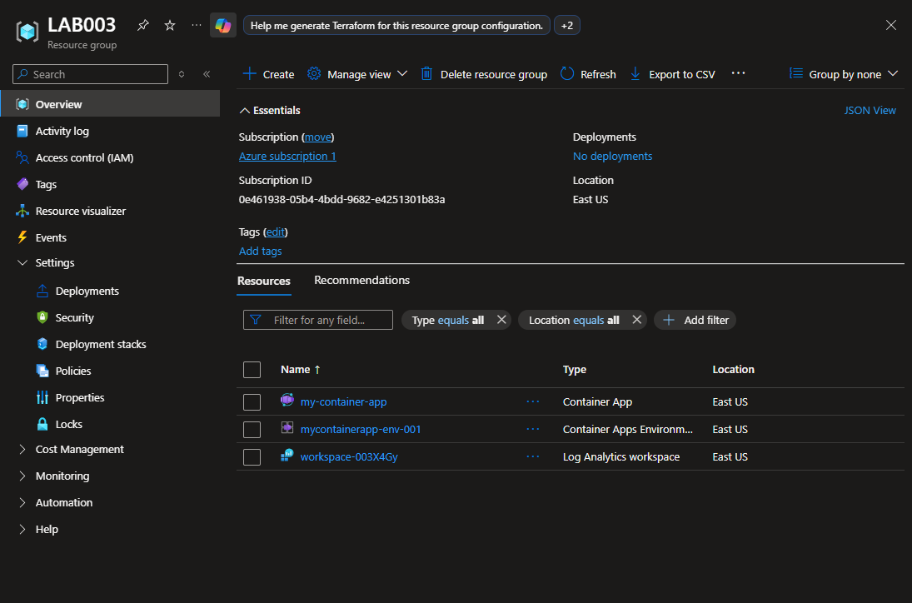

# Implantar um aplicativo de contêiner

Esse lab...

## 📌 Status
✅ Concluído

## 🎯 Objetivo
Cria um ambiente seguro dos Aplicativos de Contêiner e implantará o aplicativo de contêiner.

- Prepare o seu ambiente
- Criar um ambiente de Aplicativos de Contêiner do Azure
- Criar um aplicativo de contêiner
- Verificar a implantação
- Limpar os recursos

## 🛠️ Serviços Azure Utilizados

- Cloud shell
- Container App
- Log Analytics workspace

## 🏗️ Configuração do Ambiente

- Criação de Resource Group dedicado ao projeto
- Criação de Container App via Cloud Shell

## 📷 Evidências

    
    
