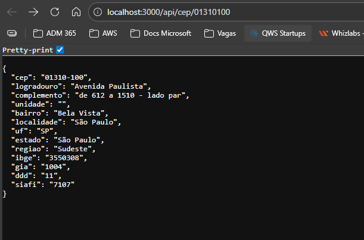
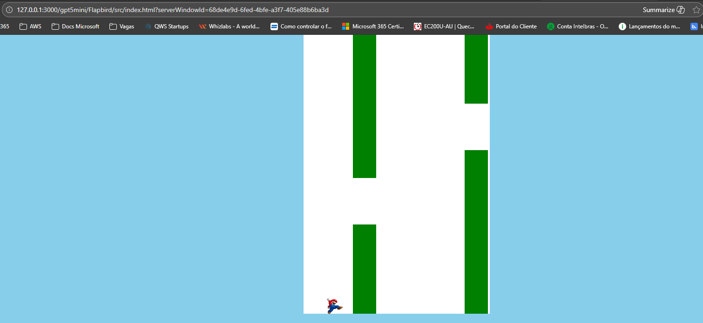
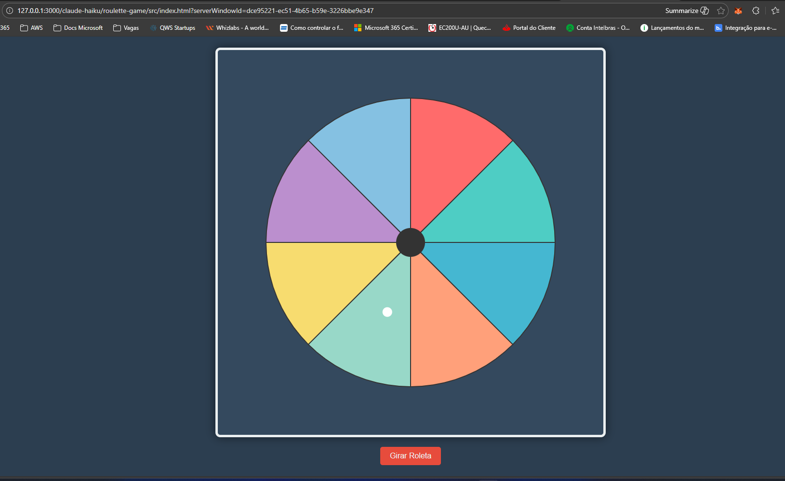

# Desenvolvimento com IA usando GitHub Copilot

Este laboratório documenta a **implementação prática** das soluções desenvolvidas com apoio de Inteligência Artificial, utilizando o GitHub Copilot no Visual Studio Code.

Aqui estão centralizados **códigos, imagens, testes e evidências** do uso de IA durante o desenvolvimento.

## 🛠️ Ferramentas Utilizadas

- Visual Studio Code
- GitHub Copilot
- Node.js
- HTML, CSS e JavaScript
- APIs locais em JSON

## 📷 Evidências

      
    
    

## 🔬 Atividades Realizadas

### 🎰 Roleta de Jogo
- Geração de lógica de jogo com apoio de IA
- Ajustes manuais para regras e comportamento
- Comparação entre sugestões de diferentes LLMs

### 🐦 Jogo Flappy Bird
- Criação da estrutura do jogo com IA
- Geração de lógica de colisão e movimentação
- Ajustes de desempenho e jogabilidade

### 🌐 API em Node.js
- Criação de uma API simples para busca de endereços
- Leitura de dados a partir de arquivos JSON
- Organização de rotas e respostas HTTP

## 📌 Observações Técnicas

- O código gerado pela IA foi revisado e ajustado manualmente
- A IA foi utilizada como apoio, não como solução final
- O laboratório prioriza aprendizado prático e experimentação
